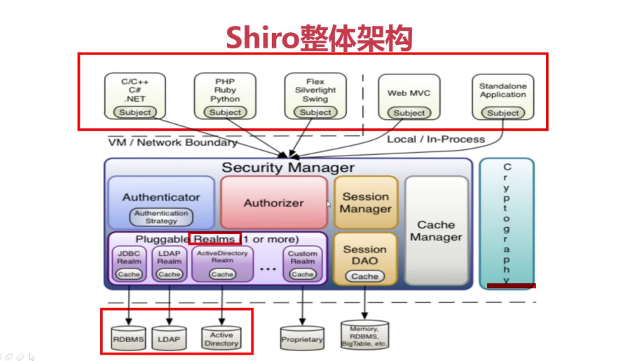
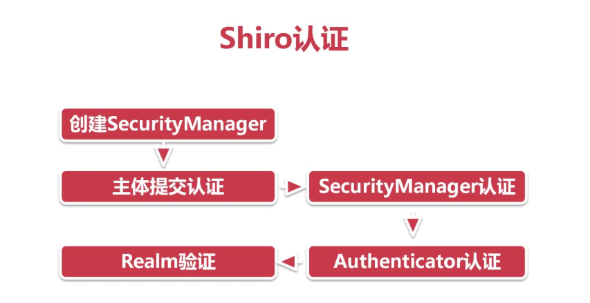
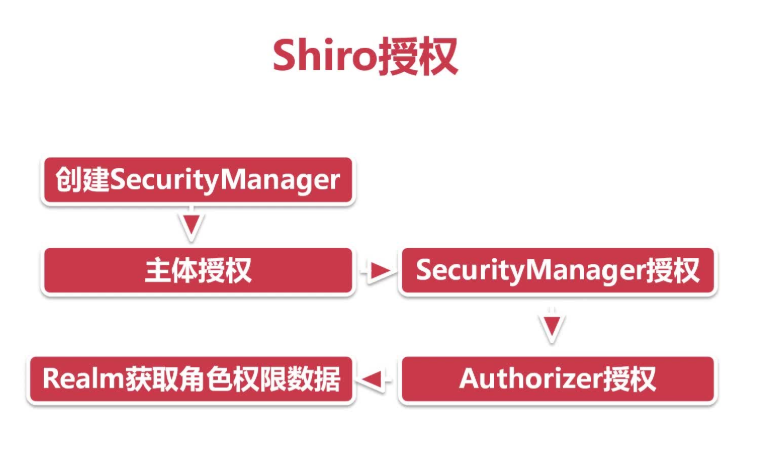

#   shiro总结

*   shiro与spring security的对比

        Shiro安全框架：简单灵活、可脱离Spring 独立存在、粒度较粗
        
        Spring Security ：复杂笨重、必须依托与Spring、粒度较细
        
        由于权限管理模块一般都是在资源一层，如果更深一层的话，则可能会与业务代码进行耦合，故提倡Shiro做权限管理，Spring官网也是用Shiro进行的权限管理。
        
*   shiro整体架构

        Shiro也是通过Security Manager提供安全服务
        
        Authenticator 认证器 管理登入登出
        
        Authorizer 授权器 赋予主体有哪些权限
        
        Session Manager Shiro自己实现的session管理
        
        Session Dao 对Session进行增删改查
        
        Cache Manager  缓存管理 可以缓存角色数据、权限数据        
        
        流程：
            当主体访问权限管理器，如果做认证操作，则将数据传入到相应的认证管理器，认证管理器通过Realms访问数据源，返回数据信息进行比对，将结果返回，同理其他的模块也是一样。
            
*   shiro认证

            
       
        流程：
            创建Security Manager 管理，然后主体进行数据提交认证，转移到相应的Security Manager中，然后权限管理调用相应的Authenticator认证，认证部分调用相应的Realm去连接数据源进行数据验证。
        
        ps：Realm是在Security Manager中，所以需要设置Realm到Security Manager中，才能调用。     
        
*   shiro授权

           
       
       流程和认证差不多。
       
*    realm

>   -   IniRealm 

            Shiro的IniRealm 形式：此形式主要是将数据存放到相应的user.ini即文件系统中，通过给定的格式，从文件中查找相应的数据是否存在。
            
            步骤：
            
            1.删除之前SimpleAccountRealm，在实体中创建IniRealm并实例化。在构造方法中传入相应的user.ini地址。此文件地址一般写为：classpath:user.ini的形式。
            
              需要在相应的包中建立resource文件夹，并且放入user.ini文件。
            
            2.user.ini文件的定义格式为：[users] 用户名=密码,角色 [roles] 角色=权限名（例子：amdin=user:delete,user:update）
            
            3.与之前认证与授权步骤一样，直接将IniRealm放入到SecurityManager中，进行登录认证，之后进行checkRoles验证与checkPersimmon验证权限等操作即可。
            
>   -   jdbcRealm

            JdbcRealm的方式访问数据库，通过与数据库的连接，验证相应的登录用户与授权。
            
            1.jdbcRealm新建其实例，并初始化。
            
            2.Maven中引入mysql的驱动以及相应数据源的类。
            
            3.新建数据源作为成员变量，并且在静态快中初始化url、username、password等。
            
            4.将数据源设置到到jdbcrealm中，并且将此realm设置到权限管理中。
            
            5.之后进行登录等验证，jdbcrealm会在源码的地方写入了默认的进行认证与授权的sql语句，以及表名什么的都规定好了。如果想更改，则写入新的sql语句，并且调用jdbcrealm中的设置认证Query、设置权限Query、设置角色查询的方法，进行修改。
            
            6.当查询权限的时候，会报错，即便库汇总有次权限，仍旧会报错，因为你需要在jdbcrealm中开启persimisson的为true即可。
            
            7.其他的与之前的认证与授权的步骤一致。
            
            ps.jdbcRealm自定义了一些sql。
            
>   -   自定义realm

            自定义的Realm，主要注意一下几个步骤：
            
            1.首先继承并实现类AuthorizingRealm的方法。其中方法
            
            2.doGetAuthenticationInfo 主要做认证操作，即可以通过获取其中的
            
            用户名，查询出相应的密码，然后将用户名与密码一并返回，shiro会自动根据传入的用户名与密码与此Realm返回的用户名和密码作比对，返回你想要的结果。同理doGetAuthorizationInfo主要是用来做角色与权限的验证，也是通过用户名，从数据库中查找到相应的角色或者权限的数据并返回一个Simple的授权类，授权系统会根据传入的参数与返回的结果集对比，存在返回true不存在则抛异常。
            
            3.两者方法只能获取用户名称，通过用户名称连接数据库获取其他信息。这里只是做数据准备操作，并不做判断是否传入的值与其相符的操作，此操作在此之后进行。
            
            4.根据两者的返回对象分别返回Simple类型的对象。认证的对象需要将你获取的用户名和密码放到构造方法中。授权的对象需要你set到相应的方法中。
            
            5.例子中只是从本地写死静态类，之后必须写入相应的数据库连接。    
            
*   shiro加密加盐

*   shiro集成ssm

*   shiro会话管理

*   shiro缓存管理

                                        